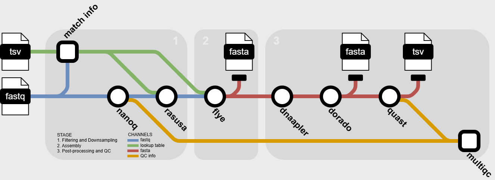

## Introduction

**ncezid-biome/stylo** is a bioinformatics pipeline that can be used to filter, downsample, assemble, and QC [ONT](https://nanoporetech.com/) longreads. It takes a samplesheet and FASTQ files as input, performs read filtering, downsampling to specified coverage, assembly, and Quality Control (QC).



1. Filters low quality reads ([nanoq](https://github.com/esteinig/nanoq))
2. Downsamples reads to specific coverage ([rasusa](https://github.com/mbhall88/rasusa))
3. Assembles reads ([Flye](https://github.com/mikolmogorov/Flye))
4. Reorients assembly ([Dnaapler](https://github.com/gbouras13/dnaapler))
5. Error correction ([Medaka](https://github.com/nanoporetech/medaka))
6. QCs assembly ([busco](https://github.com/metashot/busco))

## Usage

> [!NOTE]
> If you are new to Nextflow and nf-core, please refer to [this page](https://nf-co.re/docs/usage/installation) on how to set-up Nextflow.

> [!NOTE]
> This pipeline was tested using the following, other versions may work but are currently untested
> 
> nf-core v2.14.1
> 
> nextflow v24.04.2
> 
> singularity v3.8.7

First, download this branch to your preferred directory
```bash
cd /path/to/dir/
git clone -b nf-core-dev git@github.com:ncezid-biome/stylo.git
```

Second, prepare a samplesheet with your input data that looks as follows:

`samplesheet.csv`:

```csv
sample,fastq,genus,species
sample1,/path/to/sample1.fastq.gz,Salmonella,enterica
sample2,/path/to/sample2.fastq.gz,Campylobacter,coli
sample3,/path/to/sample3.fastq.gz,Campylobacter,jejuni
sample4,/path/to/sample4.fastq.gz,Vibrio,-
sample5,/path/to/sample5.fastq.gz,Salmonella,enterica
```

Each row represents a fastq file (single-end) with the known genus and species.

> [!NOTE]
> you can use `-` where the species is unknown

Third, look at the [lookup table](conf/lookup_table.tsv) to make sure that each genus listed in your samplesheet is present. If you'd like to add a row or edit the lookup table see [Advanced Usage](#advanced-usage)


Now, you can run the pipeline using:

```bash
nextflow run /path/to/stylo/main.nf \
   -profile singularity
   --input samplesheet.csv \
   --outdir <OUTDIR>
```

If you're on CDC servers use `-profile rosalind`


> [!WARNING]
> Please provide pipeline parameters via the CLI or Nextflow `-params-file` option. Custom config files including those provided by the `-c` Nextflow option can be used to provide any configuration _**except for parameters**_;
> see [docs](https://nf-co.re/usage/configuration#custom-configuration-files).

For more details about generic usage see the [Usage Page](docs/usage.md)

## Advanced Usage

### Editing the Lookup Table
If a genus is missing, then you'll need to add a row to the lookup table prior to running the pipeline. In order to add a row to the lookup table you'll need the following information:

1. genus (required)
2. species (optional, use `-` if you want the lookup table to accept all species within that genus)
3. genomes size (required, must follow the same format as the other rows in MBs)

### model parameter
If the model parameter is left blank, the pipeline will choose the bacterial methylation model `r1041_e82_400bps_bacterial_methylation`.
It's best to let the pipleine use the bacterial methylation model, but if you must specify the model parameter make sure to use one of the models from the following list

```
r103_sup_g507
r1041_e82_260bps_fast_g632
r1041_e82_260bps_hac_g632
r1041_e82_260bps_hac_v4.0.0
r1041_e82_260bps_hac_v4.1.0
r1041_e82_260bps_joint_apk_ulk_v5.0.0
r1041_e82_260bps_sup_g632
r1041_e82_260bps_sup_v4.0.0
r1041_e82_260bps_sup_v4.1.0
r1041_e82_400bps_bacterial_methylation
r1041_e82_400bps_fast_g615
r1041_e82_400bps_fast_g632
r1041_e82_400bps_hac_g615
r1041_e82_400bps_hac_g632
r1041_e82_400bps_hac_v4.0.0
r1041_e82_400bps_hac_v4.1.0
r1041_e82_400bps_hac_v4.2.0
r1041_e82_400bps_hac_v4.3.0
r1041_e82_400bps_hac_v5.0.0
r1041_e82_400bps_hac_v5.0.0_rl_lstm384_dwells
r1041_e82_400bps_hac_v5.0.0_rl_lstm384_no_dwells
r1041_e82_400bps_hac_v5.2.0
r1041_e82_400bps_hac_v5.2.0_rl_lstm384_dwells
r1041_e82_400bps_hac_v5.2.0_rl_lstm384_no_dwells
r1041_e82_400bps_sup_g615
r1041_e82_400bps_sup_v4.0.0
r1041_e82_400bps_sup_v4.1.0
r1041_e82_400bps_sup_v4.2.0
r1041_e82_400bps_sup_v4.3.0
r1041_e82_400bps_sup_v5.0.0
r1041_e82_400bps_sup_v5.0.0_rl_lstm384_dwells
r1041_e82_400bps_sup_v5.0.0_rl_lstm384_no_dwells
r1041_e82_400bps_sup_v5.2.0
r1041_e82_400bps_sup_v5.2.0_rl_lstm384_dwells
r1041_e82_400bps_sup_v5.2.0_rl_lstm384_no_dwells
r104_e81_fast_g5015
r104_e81_hac_g5015
r104_e81_sup_g5015
r104_e81_sup_g610
r941_e81_fast_g514
r941_e81_hac_g514
r941_e81_sup_g514
r941_min_fast_g507
r941_min_hac_g507
r941_min_sup_g507
r941_prom_fast_g507
r941_prom_hac_g507
r941_prom_sup_g507
```

for more details about model selection in medaka, see [medaka model documentation](https://github.com/nanoporetech/medaka/tree/366ff49ad9e2be6862e376630b51b3b3d28944c2#models)

## Credits

ncezid-biome/stylo was originally written by Arzoo Patel, Mohit Thakur.

We thank the following people for their extensive assistance in the development of this pipeline:

Justin Kim, Jessica Chen, Peyton Smith, Lee S. Katz, Joe Wirth, Curtis Kapsak

## Contributions and Support

If you would like to contribute to this pipeline, please see the [contributing guidelines](.github/CONTRIBUTING.md).

## Citations

<!-- TODO nf-core: Add citation for pipeline after first release. Uncomment lines below and update Zenodo doi and badge at the top of this file. -->
<!-- If you use ncezid-biome/stylo for your analysis, please cite it using the following doi: [10.5281/zenodo.XXXXXX](https://doi.org/10.5281/zenodo.XXXXXX) -->

<!-- TODO nf-core: Add bibliography of tools and data used in your pipeline -->

An extensive list of references for the tools used by the pipeline can be found in the [`CITATIONS.md`](CITATIONS.md) file.

This pipeline uses code and infrastructure developed and maintained by the [nf-core](https://nf-co.re) community, reused here under the [MIT license](https://github.com/nf-core/tools/blob/master/LICENSE).

> **The nf-core framework for community-curated bioinformatics pipelines.**
>
> Philip Ewels, Alexander Peltzer, Sven Fillinger, Harshil Patel, Johannes Alneberg, Andreas Wilm, Maxime Ulysse Garcia, Paolo Di Tommaso & Sven Nahnsen.
>
> _Nat Biotechnol._ 2020 Feb 13. doi: [10.1038/s41587-020-0439-x](https://dx.doi.org/10.1038/s41587-020-0439-x).
