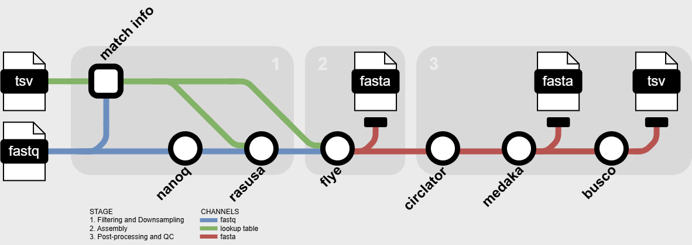

--- 
title: "stylo: a lightweight nanopore assembly pipeline optimized for enteric bacteria"
tags: 
  - nextflow 
  - bioinformatics 
  - genomics 
  - bacteria 
  - assembly 
  - nanopore 
  - long-reads 
  - quality control 
  - filtering 
  - downsampling 
  - ont 
  - nf-core style 
authors: 
  - name: Arzoo Patel 
    orcid: 0009-0007-9033-5785 
    equal-contrib: true 
    affiliation: "1,2" 
  - name: Mohit Thakur 
    orcid: 0009-0003-2927-6051
    equal-contrib: true 
    affiliation: 1 
  - name: Justin Kim 
    orcid: 0000-0001-8745-9612
    affiliation: "1,2"
  - name: Peyton Smith 
    orcid: 0000-0002-5446-5298
    affiliation: 1 
  - name: Lee S. Katz
    orcid: 0000-0002-2533-9161
    affiliation: 1 
  - name: Curtis Kapsak 
    orcid: 0000-0002-8735-1190
    affiliation: "1,3"
  - name: Jessica Chen 
    orcid: 0000-0002-9320-6774
    affiliation: 1
affiliations: 
 - name: Enteric Diseases Laboratory Branch, Division of Foodborne, Waterborne, and Environmental Diseases, National Center for Emerging and Zoonotic Infectious Diseases, Centers for Disease Control and Prevention, Atlanta, Georgia 
   index: 1
 - name: ASRT Inc., Contractor for National Center for Emerging and Zoonotic Infectious Diseases, Centers for Disease Control and Prevention, Atlanta, Georgia, USA.
   index: 2
 - name: Theiagen Genomics, Highlands Ranch, Colorado
   index: 3
date: 31 March 2025 
bibliography: paper.bib 
---

# Summary

Oxford Nanopore Technologies (ONT) sequencing is a promising technology with many potential applications in food safety. We have developed stylo, a lightweight nf-core style assembly workflow for ONT long-reads, specifically optimized for enteric bacteria. The pipeline downsamples, assembles, and performs post-processing and quality control by combining nanoq [@Steinig2022], Rasusa [@Hall2022], Flye [@Kolmogorov2019], Dnaapler [@Bouras2024], Medaka [@medaka], and QUAST [@Mikheenko2018].  All of stylo’s dependencies are containerized and the pipeline is available on GitHub. 

# Statement of Need

There is a continuous need for foodborne outbreak detection in public health. To determine the scope or severity of a foodborne outbreak, short-read whole genome sequencing has often been used to generate isolate assemblies of enteric bacteria often which supports rapid and accurate outbreak detection [@Ribot2016-ps;@Timme2017-gl]. However, as nanopore long-read sequencing becomes more cost-effective and accurate, the need increases for streamlined assembly pipelines to support high-throughput surveillance processing of ONT sequenced isolates [@mbs:/content/journal/mgen/10.1099/mgen.0.001246;@doi:10.1128/jcm.00246-24]. With the increased adoption of modern high-performance computing and cloud servers, pipelines built to leverage containerization and custom configurations allow for easy deployment on those servers. To address these needs, we have created stylo, a lightweight nf-core style nanopore assembly pipeline optimized for enteric bacteria [@Di-Tommaso2017;@Ewels2020].  

Since stylo is lightweight, it can be run in automated disease surveillance settings, such as PulseNet, which facilitates the rapid detection of illness clusters and reduces the likelihood of outbreaks becoming large and widespread [@doi:10.1089/fpd.2006.3.9;@doi:10.1089/fpd.2019.2637]. Stylo was designed and tested around enteric pathogens and default genome sizes were obtained through PulseNet Standard Operating Procedure [@PulseNet-sop2025], however, it does not have any strict limitation to enteric bacteria. This allows users to customize the lookup table to include any bacteria that they work with. There exist extensive nanopore assembly workflows such as Donut Falls [@DonutFalls2025], which includes hybrid assembly options and multiple rounds of polishing. However, stylo is a streamlined nanopore workflow, intended for high throughput research groups, surveillance networks, or practical assemblies for general users.

# Workflow Overview

1. Input: stylo requires a comma separated value file with columns for sample, fastq, genus, and species. Fastq files must comprise of long-reads generated on an ONT instrument. Genus and species are used to automatically determine genome size via a lookup table built into the pipeline.

2. Filtering and Downsampling: The pipeline filters out reads that are less than a user provided minimum length using nanoq. The resulting fastq is then subsampled to a user provided coverage via Rasusa. 

3. Assembly: Flye is run on the subsampled fastq using the "--nano-hq" mode by default, expecting high-quality ONT reads. This parameter can be changed by the user. 

4. Post-processing and Quality Control: The pipeline uses "dnaapler all" to reorient contigs to begin at a specific genes. The pipeline then uses Medaka to correct assembly sequences. Finally, the assembly quality is assessed via QUAST with the following speedup options: "--no-check", "--no-plots", "--no-html", "--no-icarus", "--no-snps", "--no-sv".

5. Output: The pipeline outputs files for each step. Some key files are the assembly by Flye, the final corrected assembly by Medaka, and the quality control summary by QUAST.

# Availability

Stylo is freely available and open-source. It can be downloaded from the GitHub repository available at [https://github.com/ncezid-biome/stylo](https://github.com/ncezid-biome/stylo).

# Acknowledgements

These authors contributed equally as co-first: Arzoo Patel and Mohit Thakur. We acknowledge helpful discussions from Joe Wirth. 

# References
